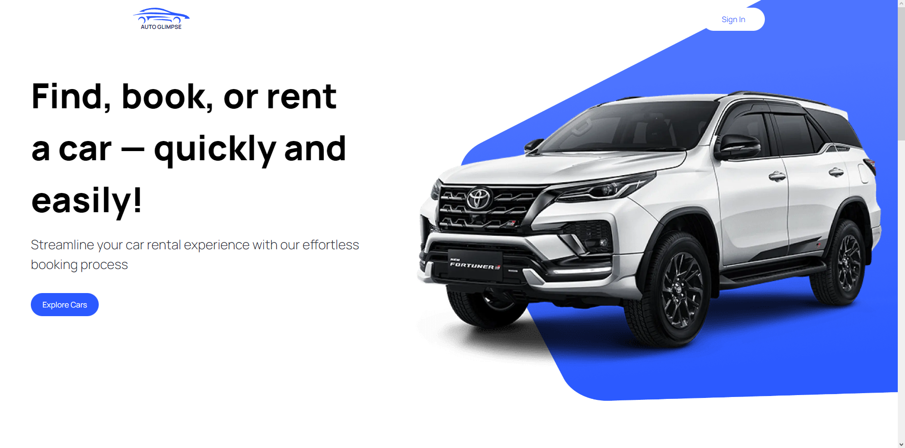
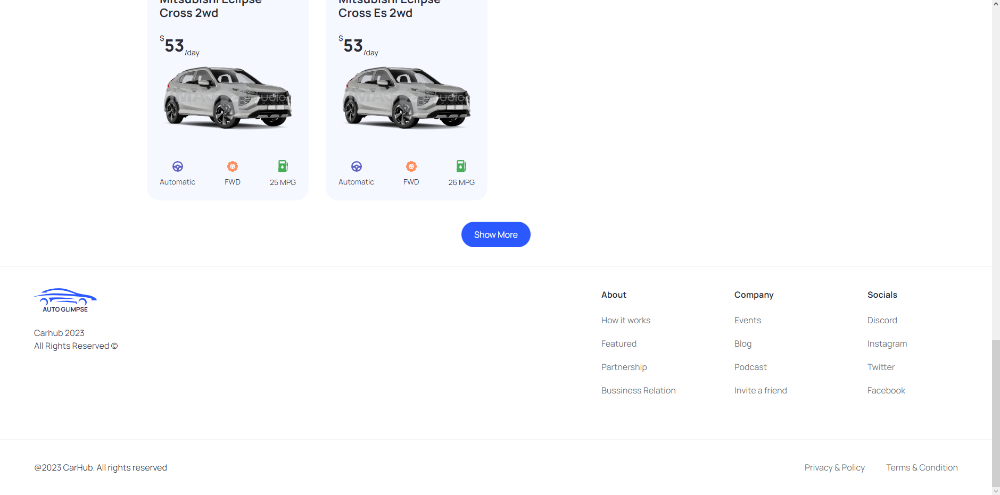

# Auto Glimpse

Auto Glimpse is a Next.js and Tailwind CSS project that showcases a curated car collection via API integration. It offers an immersive experience for enthusiasts and buyers with high-quality images and detailed information. The user-friendly, responsive design ensures smooth browsing, highlighting the synergy of frontend technology and API integration.

## Demo

Check out the live demo of Auto Glimpse [here](https://auto-glimpse.vercel.app).

## Screenshots

*Screenshot of the Hero section in Auto Glimpse*

*Screenshot of the Car Catalogue section in Auto Glimpse*

*Screenshot of the Footer section in Auto Glimpse*

## Installation

1. Clone this repository: `git clone https://github.com/NidhalChelhi/auto-glimpse.git`.
2. Navigate to the project directory: `cd auto-glimpse`.
3. Install dependencies: `npm install`.
4. Start the development server: `npm run dev`.

## Contributing

Contributions are welcome! Feel free to open issues or pull requests.

## License

This project is not licensed.

---

Created by [Nidhal Chelhi](https://nidhalchelhi.vercel.app)
